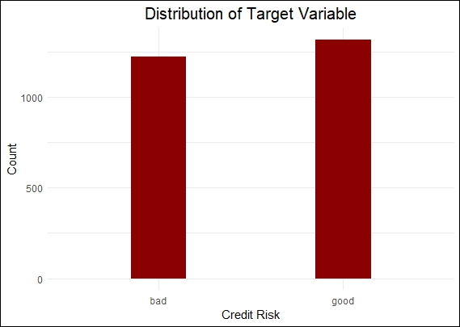
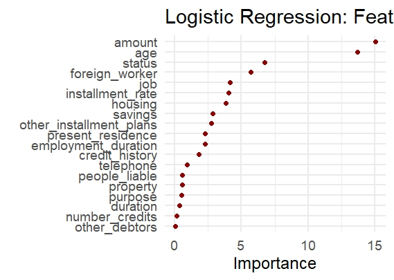
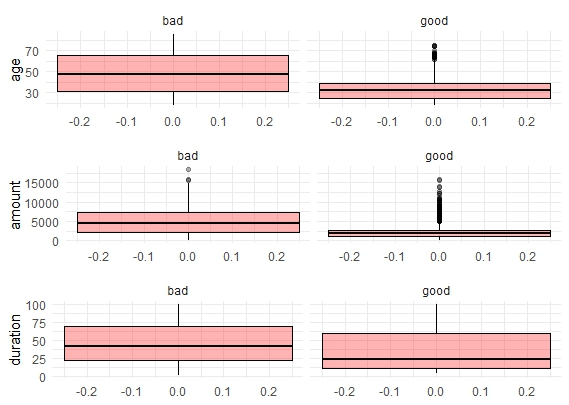

# Creditworthiness Assessment with Logistic Regression in R

## Table of Contents
- [Project Overview](#project-overview)
- [Data Handling](#data-handling)
- [Data Visualization](#Data-Visualization)

## Project Overview
The project focused on improving the lending operations of a reputable financial institution by developing a robust credit risk assessment model using R. 
The model was designed to predict the likelihood of loan defaults, enabling the institution to mitigate credit risks, enhance profitability, and 
maintain financial stability.

The dataset for this project was provided by the financial institution to 10Alytics Consultants for in-depth analysis and model development

## Data Handling
The data was cleaned and preprocessed to ensure accuracy and consistency.  

## Data Visualization

